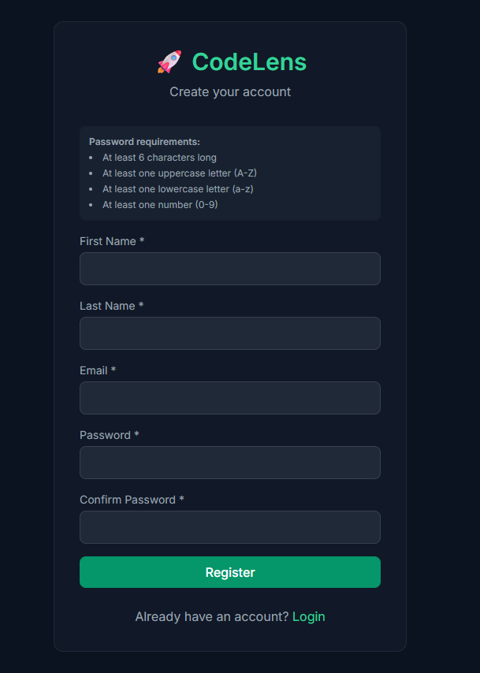
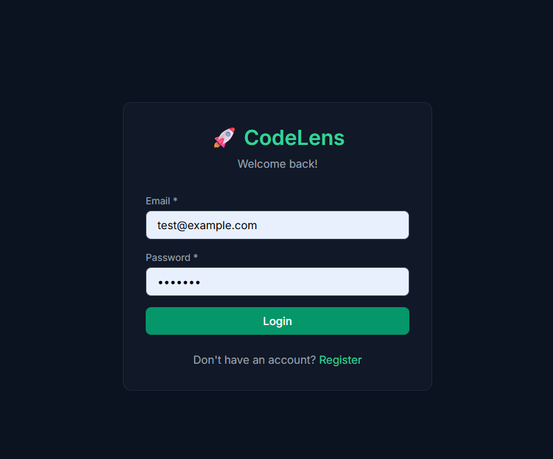
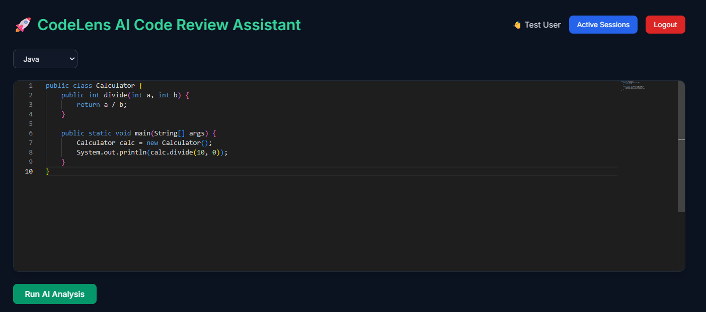
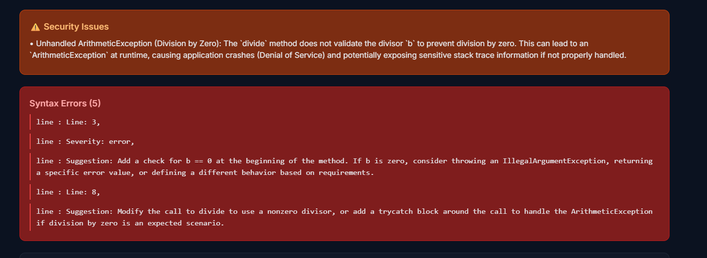
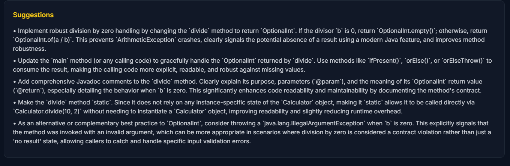
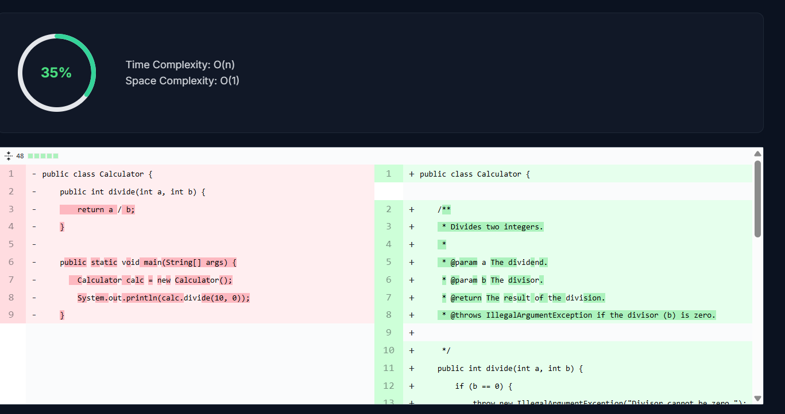
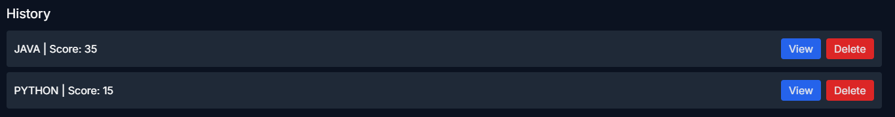

# 📌 Codelens-AI Code Review Assistant
**CodeLens** is a full-stack AI-powered code review platform that helps developers analyze, optimize, and improve source code efficiently. It detects syntax errors, security vulnerabilities, and performance issues while providing intelligent suggestions using Google Gemini AI. 

The platform also estimates time and space complexity, generates quality scores, and visualizes code improvements through an interactive diff viewer.

---

# ✨ Features

## 🔐 Authentication
- JWT-based user registration and login
- Role-based access control
- Secure session management
- Password hashing using ASP.NET Core Identity

## 🤖 AI Code Analysis
- Multi-language support:
  - Python
  - JavaScript
  - Java
  - C
  - C++
- Syntax error detection
- Security vulnerability scanning
- Time & Space complexity estimation
- AI-powered optimization suggestions
- Quality score generation (0-100)

## 💾 History Management
- Persistent analysis history
- View & delete previous reports
- Statistics dashboard

## 🔒 Security Features
- JWT authentication
- Token validation
- Input validation
- CORS configuration
- Rate limiting support

## 🎨 User Interface
- Monaco code editor
- Side-by-side diff viewer
- Responsive dark UI
- Real-time analysis feedback
- Interactive score visualization

---

# 🛠️ Tech Stack

## ⚙️ Backend

| Technology | Purpose |
|------------|---------|
| ASP.NET Core 8 | REST API Framework |
| Entity Framework Core | ORM |
| SQLite | Database |
| JWT | Authentication |
| ASP.NET Core Identity | User Management |
| Gemini API | AI Analysis |
| Swagger/OpenAPI | API Documentation |

---

## 🖥️ Frontend

| Technology | Purpose |
|------------|---------|
| React 18 | UI Framework |
| Vite | Build Tool |
| Tailwind CSS | Styling |
| Monaco Editor | Code Editor |
| react-diff-viewer | Code Comparison |

---

# 📁 Project Structure

```bash
CodeLens/
├── codelens-backend/
│   ├── CodeLens.API/
│   │   ├── Controllers/
│   │   ├── Data/
│   │   └── Program.cs
│   │
│   ├── CodeLens.Core/
│   │   └── Models/
│   │
│   └── CodeLens.Services/
│       ├── AI/
│       └── Services/
│
├── codelens-frontend/
│   ├── src/
│   │   ├── components/
│   │   ├── pages/
│   │   ├── App.jsx
│   │   └── main.jsx
│   └── package.json
│
├── screenshots/
├── README.md
└── .gitignore
```

---

# 📸 Screenshots

## 🔐 Register Page


---

## 🔑 Login Page


---

## 🖥️ Monaco Code Editor


---

## ❌ Syntax Error Detection


---

## 🤖 AI Suggestions & Optimization


---

## 🔍 Diff Viewer


---

## 🕘 History Dashboard


---

# 🚀 Getting Started

## 📋 Prerequisites

- .NET 8 SDK
- Node.js v18+
- Git

---

# ⚙️ Installation

## 1️⃣ Clone Repository

```bash
git clone https://github.com/sasichintada/Codelens.git
cd Codelens
```

---

## 2️⃣ Backend Setup

```bash
cd codelens-backend
dotnet restore
dotnet build

cd CodeLens.API
dotnet ef database update
dotnet run
```

Backend runs at:

```bash
http://localhost:5120
```

---

## 3️⃣ Frontend Setup

```bash
cd codelens-frontend
npm install
npm run dev
```

Frontend runs at:

```bash
http://localhost:5173
```

---

# 🔑 Configuration

Update `appsettings.json`:

```json
{
  "AI": {
    "ApiKey": "YOUR_GEMINI_API_KEY",
    "Model": "gemini-2.5-flash"
  }
}
```

---

# 📡 API Endpoints

## 🔐 Authentication

| Method | Endpoint | Description |
|--------|----------|-------------|
| POST | `/api/Auth/register` | Register user |
| POST | `/api/Auth/login` | Login |
| POST | `/api/Auth/logout` | Logout |

---

## 🤖 AI Analysis

| Method | Endpoint | Description |
|--------|----------|-------------|
| POST | `/api/AIAnalysis/analyze` | Analyze code |
| GET | `/api/AIAnalysis/health` | Health check |

---

## 🕘 History

| Method | Endpoint | Description |
|--------|----------|-------------|
| GET | `/api/History/recent` | Recent analyses |
| DELETE | `/api/History/{id}` | Delete analysis |

---

# 📊 Sample API Response

```json
{
  "qualityScore": 85,
  "timeComplexity": "O(n)",
  "spaceComplexity": "O(1)",
  "suggestions": [
    "Add type hints",
    "Improve recursion handling"
  ]
}
```

---

# 🔮 Future Enhancements

- Docker support
- PostgreSQL integration
- WebSocket live updates
- Unit testing
- GitHub Actions CI/CD
- Advanced AST parsing

---

# 👨‍💻 Author

## Chintada Sasank Kumari

- GitHub: https://github.com/sasichintada

---

# 📄 License

This project is licensed under the MIT License.

---
